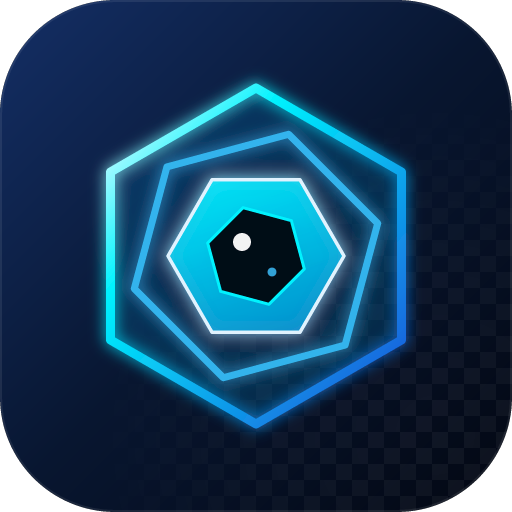

<div align="center">



# Imgeye

轻量级图像查看器 —— 单文件便携、无需安装即可用，支持多种常见格式及自定义高灰度格式。

</div>

---

## 特性

- **支持格式**：BMP · PNG · JPEG · GIF · TIFF · ICO · WebP · SVG，以及自定义 **HIG** 高灰度图像（8/10/12/16 位单通道）。
- **高灰度真实取值**：鼠标指向灰度图（HIG、16 位 TIFF/PNG）时，状态栏显示**真实灰度值**，而非 8 位映射值。
- **窗宽调节**：打开 HIG 时提供窗宽拖动条，实时调整显示对比度（不影响真实数据与保存）。
- **缩放与平移**：滚轮 / 快捷键以光标为中心缩放，拖拽平移，支持一键「最佳适配」。
- **文件夹浏览**：打开或拖入图片后，用 ←/→ 键在同文件夹内浏览上一张 / 下一张。
- **取色**：右键拷贝像素的 RGB 或十六进制颜色。
- **GIF 播放**：上一帧 / 下一帧、播放 / 暂停、播放速率调节。
- **SVG 编辑**：左图右码分栏，源码自动换行 + 语法高亮，`Ctrl+S` 保存并实时重渲染。
- **旋转与保存**：左 / 右旋转 90°；`Ctrl+S` 覆盖保存，16 位图保留位深。
- **透明展示**：透明背景以棋盘格（菱形纹）显示，与真实黑色内容清晰区分。
- **单文件便携**：静态链接，绿色免安装；附带 Inno Setup 安装脚本，可注册全部支持的图片格式关联。

## 构建

依赖：Windows + Visual Studio（MSVC）+ CMake + Ninja。

```bat
build.bat
```

预编译的第三方库（`third_party/`）：
- **resvg** —— SVG 栅格化
- **Scintilla + Lexilla** —— SVG 源码编辑（自动换行 + XML 语法高亮）

## 安装

运行 `installer/ImgeyeSetup.exe`（由 `ImgeyeSetup.iss` 构建），向导中可勾选把各类图片格式设为默认用 Imgeye 打开；卸载时完整移除关联与文件。

## 快捷键

| 按键 | 功能 |
|---|---|
| `Ctrl+O` / `Ctrl+S` | 打开 / 保存 |
| `Ctrl+0` / `Ctrl+1` | 最佳适配 / 实际尺寸 |
| `+` `-` / 滚轮 | 放大 / 缩小 |
| `←` `→` | 上一张 / 下一张 |
| `F11` / `Esc` | 全屏 / 退出全屏 |

## 许可

随 resvg 与 Scintilla 采用宽松许可，可自由使用于免费或商业项目。